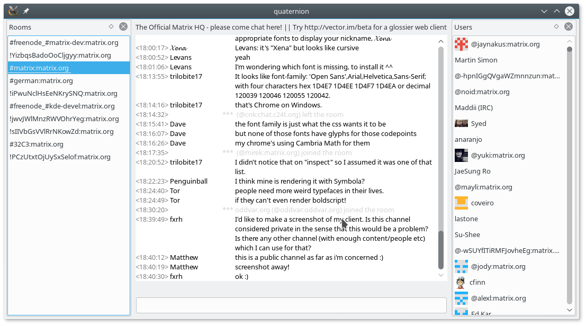

# Quaternion
Quaternion is an IM client for the [Matrix](https://matrix.org) protocol in development.

## Dependencies
- Linux or Windows system (MacOS should work too)
- C++ toolchain that can deal with Qt (see a link for your platform in http://doc.qt.io/qt-5/gettingstarted.html#platform-requirements)
- CMake
- Qt 5
- KDE Framework Core Addons (KCoreAddons package)

## Building (Linux)
```
mkdir build
cd build
cmake ../
make
sudo make install
```

## Building (Windows)

### Dependencies installation
To install all the dependencies on Windows, you have options.

#### Build everything (including Qt and KCoreAddons) from scratch
This is slower and takes much more machine time but downloads and sets up all dependencies on your behalf (including the toolchain, unless you tell it to use Visual Studio). Just give it enough time and space to compile everything (it can easily be several hours on weaker hardware and consumes 10+ Gb). Building all the the stuff except Quaternion itself is based on this [KDE TechBase article](https://techbase.kde.org/Getting_Started/Build/Windows/emerge) - have it handy when going through it. Tested with 64-bit MinGW. Visual Studio should work as well but noone tried it yet.
- Check out and configure the emerge tool as described in the KDE TechBase article. Don't run emerge yet.
- If you don't have Windows SDK installed (it usually comes bundled with Visual Studio):
  - Download and install Windows SDK: https://dev.windows.com/en-us/downloads/windows-10-sdk and set DXSDK_DIR environment variable to the root of the installation. This is needed for Qt to compile the DirectX-dependent parts.
  - Alternatively (nobody tried yet - instructions welcome), you can setup Qt portage so that Qt compilation doesn't rely on DirectX (see http://doc.qt.io/qt-5/windows-requirements.html#graphics-drivers for details about linking Qt to OpenGL).
- Enter ```emerge qt qtquickcontrols kcoreaddons``` inside the shell made by the kdeenv script (see the KDE TechBase article), double check that the checkout-configure-build-install process works and go for other things while it builds all the stuff. Leaving it for a night should suffice.
- Make sure you have the toolchain reachable from the environment you're going to compile Quaternion in. If you plan to use the just-compiled MinGW and CMake to compile Quaternion you might want to add <KDEROOT>/dev-utils/bin and <KDEROOT>/mingw64/bin into your PATH for convenience. If you have other MinGW or CMake installations around you have to carefully select the order of PATH entries and bear in mind that emerge takes the latest versions by default (which are not necessarily the same is you installed). Alternatively: just build Quaternion inside the same kdeenv wrapper shell (not tried but should work).

#### Use official Qt binary packages and noKCoreAddons branch
This is, in theory, quicker but takes a bit of your time to gather and install the entire toolset around Qt.
In this case you basically take a Qt installer for your toolchain and let it install Qt for you. Because of Qt pre-built packages availability, you'll have to use either 32-bit MinGW or a recent version of Visual Studio. Besides the CMake and the toolchain, don't forget to install Qt's own dependencies (see http://doc.qt.io/qt-5/windows-requirements.html for details).
Once you have everything setup, you'll need to checkout noKCoreAddons branch of this repo - it includes KCoreAddons source code as a submodule assuming you don't have KCoreAddons library installed on your Windows machine.

### Building Quaternion
Once you checked that Qt works (try compiling an example that uses Qt), things are very straightforward:
- If you use MinGW from the command line (assuming you have cmake and mingw32-make in your PATH):
```
md build
cd build
cmake ../
mingw32-make
```
- If you use an IDE, import the sources into the project, run CMake and then build the project. The repository includes the CodeLite .project file that you can immediately use (assuming that mingw32-make and cmake are in your PATH).

### Installing
You might want to use [the Windows Deployment Tool](http://doc.qt.io/qt-5/windows-deployment.html#the-windows-deployment-tool) that comes with Qt - to pack up all dependent libraries and put them in one place with the executable. Not tried yet.

## Screenshot

